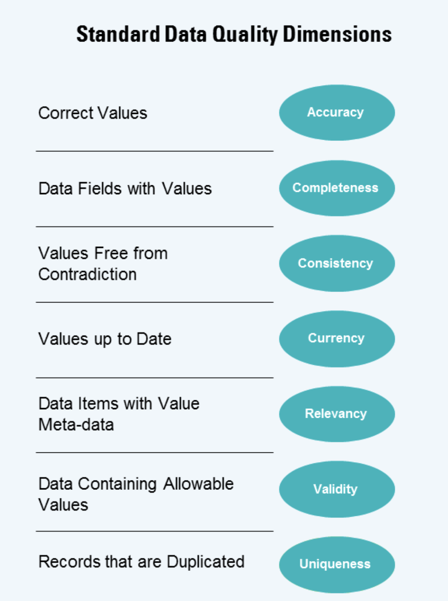
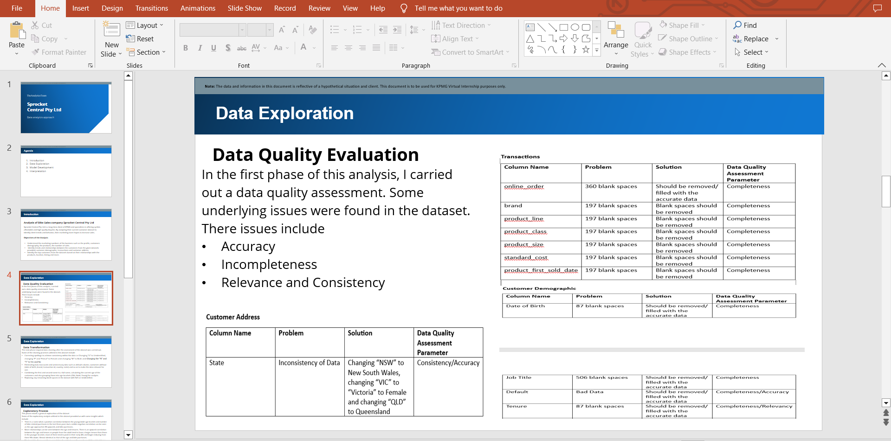

# Sprocket Central Customer Sales Analysis

## Introduction
This is an Excel/PowerBI Project on customer analysis for a fictional company for the purpose of an internship called **Sprocket Central Pty Ltd**, a medium-sized bike and cycling accessories organization. This project entails practical tasks such as data quality assessment, data insights to find out important information, and data presentation. 

**_Disclaimer_**: _The data utilized in this project do not represent any company, institution or country but for the sole purpose of a practical internship to display analytical skills._

## Dataset Information
I appreciate the opportunity given to us by Skyrocket Central Pty Ltd. by lending us these datasets for assessment. The dataset include three (3) pages in a worksheet, namely
- Transactions with	20000 rows and 13 columns
- Customer Demographic with	4000 rows and 13 columns
- Customer Address with 4000 rows and 6 columns
- New Customer List with 1002 rows and 18 columns

## Case Study / Tasks
Here is a background story to the problem: “Sprocket Central Pty Ltd, a medium size bikes & cycling accessories organization, has approached Tony Smith (a partner) in KPMG’s Lighthouse & Innovation Team. Sprocket Central Pty Ltd  is keen to learn more about KPMG’s expertise in its Analytics, Information, & Modeling team. 

Smith discusses KPMG’s expertise in this space. In particular, he speaks about how the team can effectively analyze the datasets to help Sprocket Central Pty Ltd grow its business.

Primarily, Sprocket Central Pty Ltd needs help with its customer and transactions data. The organization has a large dataset relating to its customers, but their team is unsure how to effectively analyze it to help optimize its marketing strategy”. However, the data analysis process were categorized into three task namely; Data Quality Assessment , Model Development and Data Insight & Presentation and these tasks include
1.	 Task 1 – Take a look at the following datasets provided and identify all data quality issues, Once you’ve had a look at these datasets, draft an email to the client identifying all data quality issues.
2.	 Task 2 – Create a PowerPoint presentation which outlines the approach we will be taking to identify which of the 1000 customers Sprocket Central Pty Ltd should target, based on this dataset.
3.	 Task 3 - Develop a report that we can present to the client at our next meeting. Display your data findings and results of the analysis in the report. Specifically, your presentation should specify who Sprocket Central Pty Ltd’ should be targeting out of the new 1000 Customer List.

## Data Analysis Process
Task 1 - For this task, I carried out a data quality assessment on the dataset provided by Sprocket Central Limited, noting any data quality issues discovered within the dataset using the data quality scheme provided. The dimensions of data quality that would be considered while assessing a dataset are listed below.

According to my email message, the following data quality issues were detected in the dataset after a thorough review.

Task 2 - To complete the second work, I was required to develop a PowerPoint presentation outlining the strategy to be used. The client has agreed to a three-week scope, with three phases: data exploration, model development, and interpretation. The main goal of this research is to "recommend which of these 1000 new customers should be targeted to drive the most value for the organization using the existing three datasets (customer demographic, customer address, and transactions) as a labeled dataset."

These are some of the powerpoint slides for the three phases

